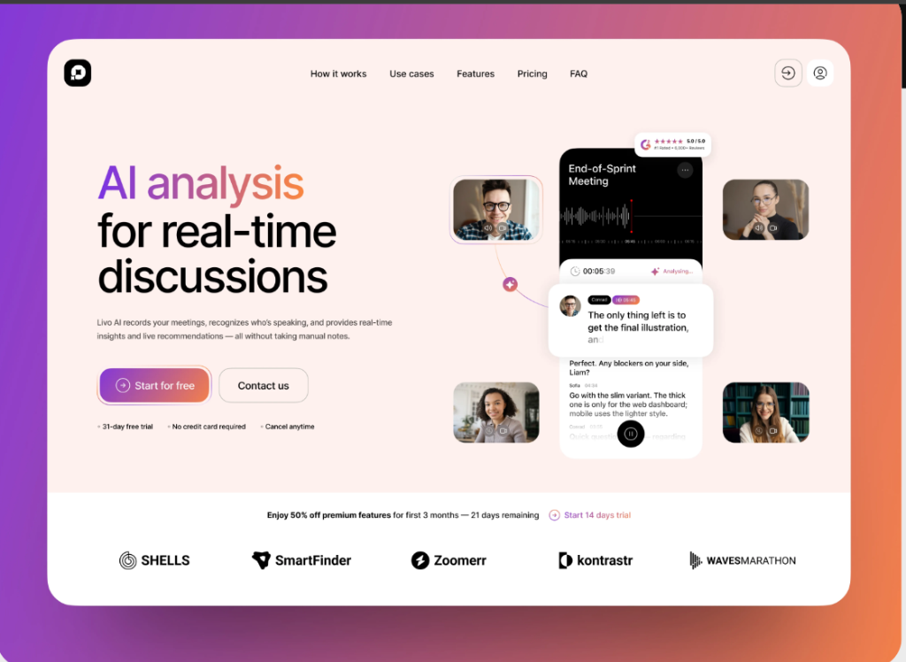
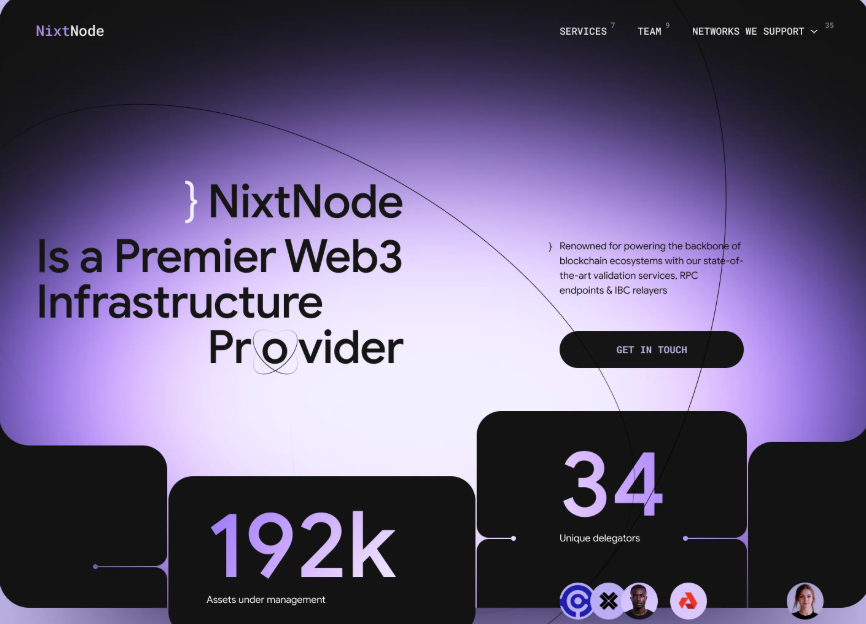
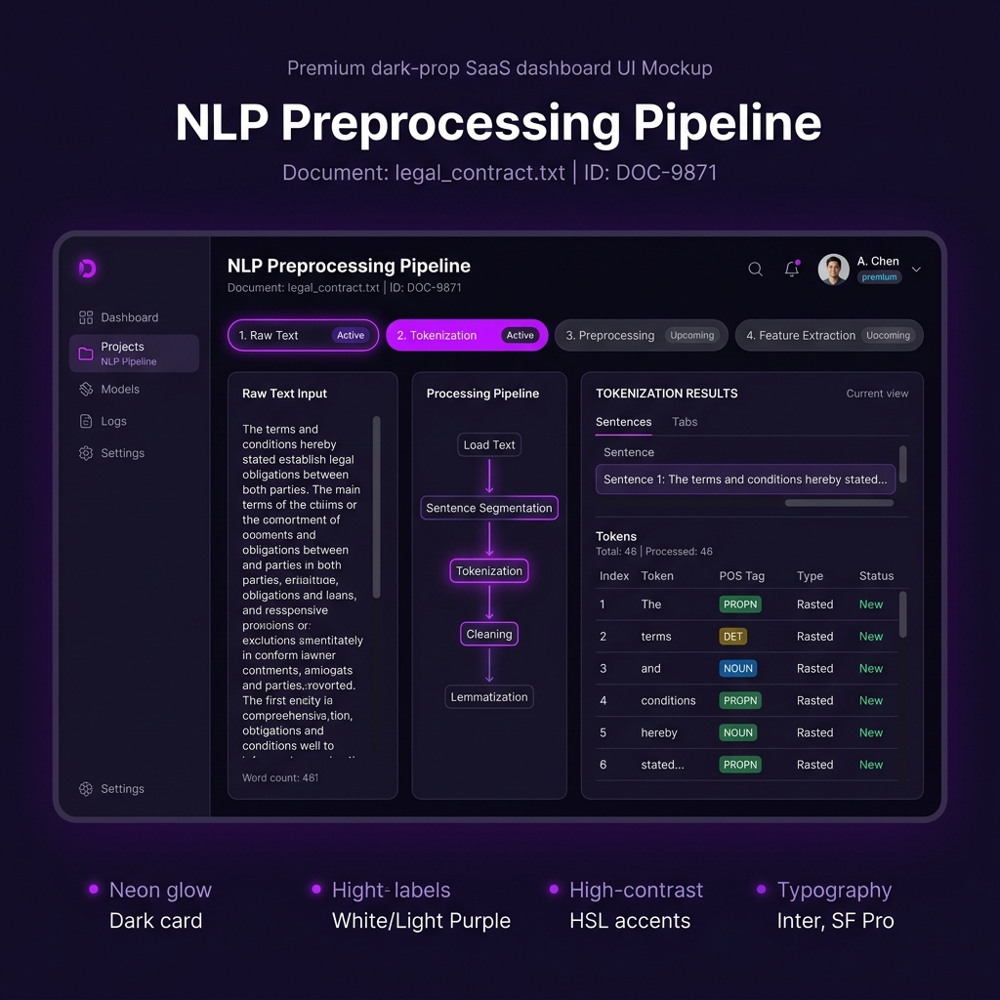
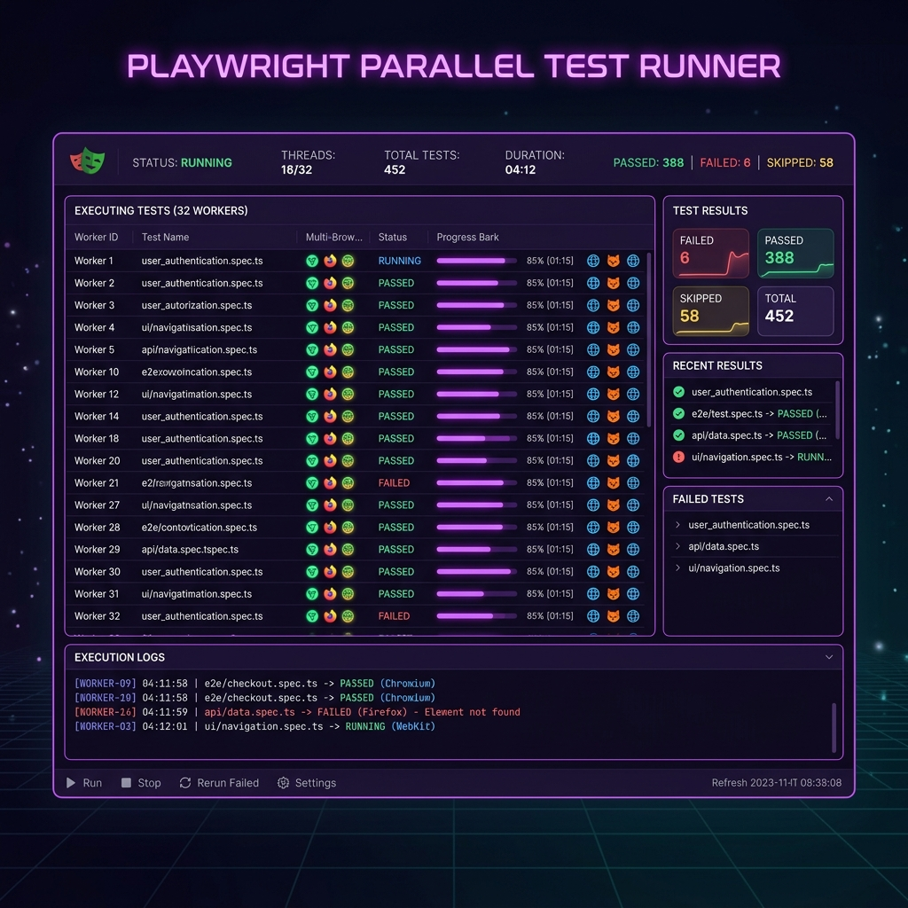
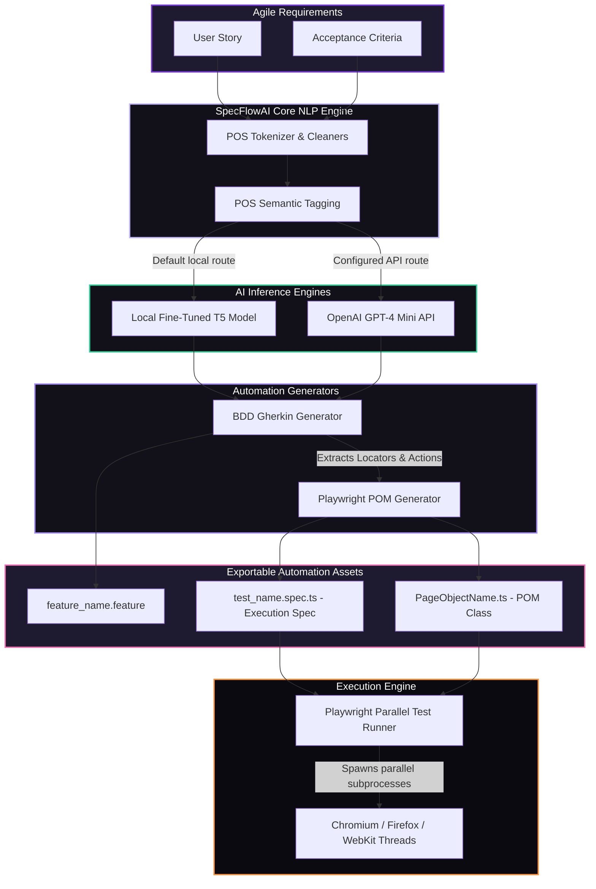

# } SpecFlowAI
### Enterprise AI-Powered Test Case Generation & Parallel Automation Runner
> A premium, production-grade test intelligence platform. Harness fine-tuned Hugging Face T5 translation models, GPT-4, and custom NLP parsers to instantly convert Agile User Stories into clean Gherkin BDD specifications and generate ready-to-run Playwright Page Object Model (POM) automation suites.

---

## 🎨 Visual Showcase & Application Screenshots

### 1. Unified Control Center & Analytics Dashboard
An overview of tokenized user stories, compiled test specifications, model confidence indicators, and parallel speedup analytics.


### 2. AI-Powered Test Generation Studio
Translate natural language inputs into clean Gherkin syntax and auto-generate comprehensive Page Object Model structures.


### 3. NLP Preprocessing Pipeline
Deep-dive token inspection showing Part-of-Speech (POS) tagging and variables mapping step-by-step.


### 4. Playwright Parallel Execution Runner
Stream live terminal outputs from concurrent browser execution threads (Chromium, Firefox, WebKit) running actual local tests.


---

## 📹 Interactive Demo & Walkthrough

| Workflow Recording: Input ➔ AI Compile ➔ Playwright Test |
| :--- |
| **Step 1:** Paste Agile User Story and Acceptance Criteria.<br>**Step 2:** Select between local HuggingFace T5 or OpenAI GPT-4 inference engines.<br>**Step 3:** Click **Compile & Generate** to create your test artifacts.<br>**Step 4:** Trigger the **Parallel Runner** to spawn actual browser instances locally. |
| _Recommended: Record a quick 30-second screen capture of this seamless flow, convert it to a `.gif` or `.mp4`, and drag it directly here to impress recruiters!_ |

---

## 🏗️ System & Core Architecture

Below is the complete end-to-end data pipeline showing how natural language requirements transform into executed browser commands:



---

## 📄 Real Generated Output Examples

### 1. Generated Gherkin Feature File (`login_flow.feature`)
```gherkin
Feature: User Login
  As a registered user
  I want to log in to my account
  So that I can access my dashboard

  Scenario: Verify User Login
    Given the user navigates to the login page "https://example.com/login"
    When the user enters username "testuser" in the username field
    And the user enters password "password123" in the password field
    And clicks the login button
    Then the user should be redirected to the dashboard page "/dashboard"
```

### 2. Generated Playwright Page Object Model Class (`UserLoginPage.ts`)
```typescript
import { Page, Locator } from '@playwright/test';

export class UserLoginPage {
  readonly page: Page;
  readonly usernameField: Locator; // Represents: username field
  readonly passwordField: Locator; // Represents: password field
  readonly loginButton: Locator;   // Represents: login button

  constructor(page: Page) {
    this.page = page;
    this.usernameField = page.locator('#username');
    this.passwordField = page.locator('#password');
    this.loginButton = page.locator('#loginButton');
  }

  async goto() {
    await this.page.goto('https://example.com/login');
  }

  async fillUsernameField(value: string) {
    await this.usernameField.fill(value);
  }

  async fillPasswordField(value: string) {
    await this.passwordField.fill(value);
  }

  async clickLoginButton() {
    await this.loginButton.click();
  }

  // High-level composite user action for login flow
  async login(username: string, password: string) {
    await this.usernameField.fill(username);
    await this.passwordField.fill(password);
    await this.loginButton.click();
  }
}
```

### 3. Generated Playwright Spec File (`user_login.spec.ts`)
```typescript
import { test, expect } from '@playwright/test';
import { UserLoginPage } from './UserLoginPage';

test.describe('User Login Tests', () => {
  let userloginpage: UserLoginPage;

  test.beforeEach(async ({ page }) => {
    userloginpage = new UserLoginPage(page);
  });

  test('Verify User Login workflow successfully', async ({ page }) => {
    // 1. Actions block
    // Given/When: the user navigates to the login page "https://example.com/login"
    await userloginpage.goto();
    // Given/When: the user enters username "testuser" in the username field
    await userloginpage.fillUsernameField('testuser');
    // Given/When: the user enters password "password123" in the password field
    await userloginpage.fillPasswordField('password123');
    // Given/When: clicks the login button
    await userloginpage.clickLoginButton();

    // 2. Assertions / Expect block
    // Then: the user should be redirected to the dashboard page "/dashboard"
    await expect(page).toHaveURL(/.*\/dashboard/);
  });
});
```

---

## 🛠️ Technology Stack

- **Backend Predictive Core:** FastAPI, PyTorch, Hugging Face `transformers` (T5-Small), Pandas, NumPy, Scikit-learn, OpenAI API Client, Uvicorn
- **Frontend Dashboard:** React 19, TypeScript, Vite, Lucide-React icons, custom Vanilla CSS Glassmorphism layers
- **Automated Testing Engine:** Playwright Test Runner (parallel browser threads)
- **Deployment & CI/CD:** Docker, Docker-Compose, GitHub Actions runner workflows

---

## ⚙️ Model Fine-Tuning CSV Schema Requirements

The local HuggingFace T5 training pipeline accepts `.csv` dataset configurations. To fine-tune the translation weights, ensure your CSV matches this standard:

| Column Header | Description | Example |
| :--- | :--- | :--- |
| `Story` | The raw Agile requirements. | `"As a customer, I want to log in so that I can view my invoice."` |
| `Criteria` | The natural language statements. | `"Given user is on login page. When enters details. Then redirected to billing."` |

---

## 💻 Local Quick Start

### Prerequisites
* **Node.js** (v20+ recommended for Vite compatibility)
* **Python** (v3.9+ with pip)

### 1. Launch the Python FastAPI Backend
Navigate to the `backend` directory, install package requirements, and start the hot-reloading server:
```bash
cd backend
pip install -r requirements.txt
python main.py
```
_The API server binds to `http://127.0.0.1:8001`._

### 2. Launch the React Web App
Navigate to the `frontend` directory, load Node modules, and boot up Vite:
```bash
cd frontend
npm install
npm run dev
```
_The UI will mount at `http://localhost:5173` (or `http://localhost:5174` if port 5173 is currently bound)._

---

## 🐳 Docker Deployment

To spin up the entire application stack in containerized microservices:
```bash
docker-compose up --build
```
* **Web App UI Portal:** `http://localhost`
* **API Service:** `http://localhost:8001`

---

## ⚙️ CI/CD Integration & Continuous Quality

Enterprise continuous automation is integrated into the following configurations:
- **[playwright.config.ts](frontend/playwright.config.ts)**: Configures browser projects (Chromium, Firefox, WebKit), execution retries, parallel thread count, and reports.
- **[.github/workflows/playwright.yml](.github/workflows/playwright.yml)**: Continuous integration pipeline setup to cache dependencies, spin up the local Vite server, and run automated verification runs on every main repository check-in.

---

## ⚖️ License

Distributed under the **MIT License**. See `LICENSE` for details.
